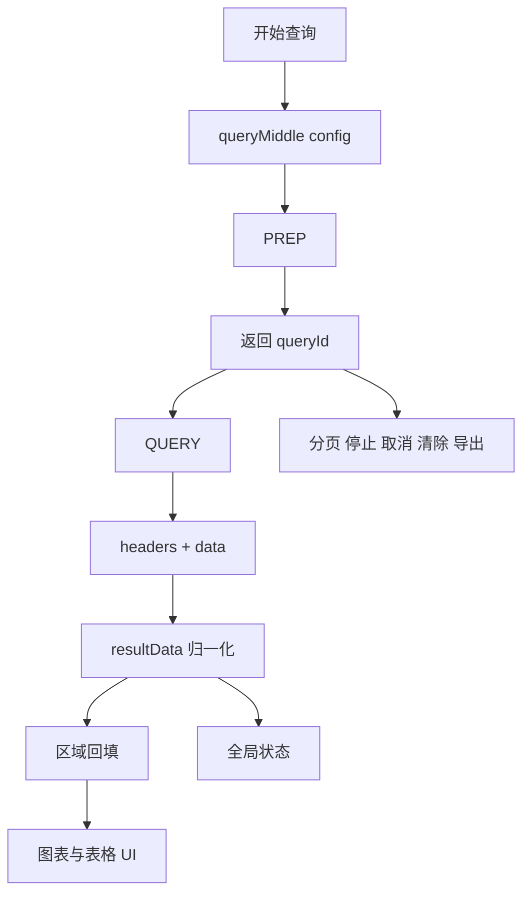

# 阶段0：预检、设计预览与开发闸门

## 目标
- 在任何实现动作前，先完成项目预检、环境与代理确认、设计预览输出，并通过严格的开发闸门控制进入实现阶段。

## 固定启动快照（必须原样保留编号）
- 进入本阶段后，必须先输出以下四段，且标题必须原样出现：

1. 项目目录
- 输出当前 `src` 下已有目录/文件与缺失目录判断。
- 若目录不存在，必须明确写出“后续按实现需要创建”。

2. 代理情况
- 输出当前代理是否已存在。
- 若已存在且与业务 MD 一致，必须明确写出“沿用该代理，不再重复追问”。

3. 私包安装状态
- 输出 `@cncr/query-engine`、`echarts`、`element-plus` 的安装状态。
- 未安装时必须明确写出“需安装”或“待安装”。

4. 设计预览模式
- 必须先输出固定选项：`1 使用 pencli MCP` / `2 不使用`。
- 选择 `1` 后，后文再输出 `pencli MCP` 或 `Mermaid fallback` 的实际执行结果。
- 选择 `2` 后，必须明确写出“设计预览已跳过（用户选择）”。

## 必须输出
- 固定启动快照（1/2/3/4）
- 设计预览模式选项
- 标准流程图结构的数据流转图
- 设计预览结果（仅模式1）
- 开发闸门提示

## 预检验证项（强制）
- **项目目录**：必须说明当前项目是清理后的最小状态，或补充扫描到的实际目录差异。
- **代理情况**：必须明确项目中是否已存在 `/brdcontrol-service` 或等价代理配置；若已存在，要先输出验证结果，再进入后续预览。
- **私包安装状态**：必须说明 `@cncr/query-engine` 是否可用，以及 `echarts`、`element-plus` 是否已安装/待安装。
- 以上三项属于开发前预检输出，必须先于设计预览出现。

## 设计预览模式选择（强制）
- 固定启动快照输出后，必须先让用户在以下选项中二选一：
  1. 使用 pencli MCP 设计预览（推荐）
  2. 不使用设计预览，直接进入扫描与实现
- 用户未明确选择前，不得直接执行 pencli 设计预览，也不得直接进入扫描/实现阶段。

## 标准数据流转图（强制）
- 无论用户选择哪种设计预览模式，都必须输出标准流程图结构的数据流转图。
- 数据流转图必须优先使用 Mermaid `flowchart TD` 代码块，不得只用自然语言摘要代替。
- Mermaid 节点文案必须使用简单稳定的短标签，推荐使用带引号的节点文本，避免复杂括号、斜杠嵌套或过长描述导致渲染异常。
- 数据流转图至少覆盖以下节点：
  - 触发入口（查询按钮 / 页面动作）
  - 请求入口
  - `PREP`
  - `queryId`
  - `QUERY`
  - 原始结果
  - `resultData/canonical`
  - 区域回填
  - UI 展示
  - 全局状态（`loading / empty / error`）
  - 分页 / 停止 / 取消 / 清除 / 导出等后续动作
- 推荐结构示例：

## 设计预览（模式1强制）
- 仅当用户选择模式 `1` 时，才执行本节的设计预览。
- 默认优先使用 **pencli MCP** 生成页面设计预览图或线框图。
- 使用 pencli MCP 前，必须先自动执行 `open_document("new")`，新建空白设计文档作为预览承载容器。
- 只有在 `open_document("new")` 失败，或新建后继续读取编辑器状态/生成预览仍失败时，才允许判定 pencli MCP 不可用并降级。
- 不得把“当前未打开文档”直接判定为 pencli MCP 不可用。
- 禁止清空当前画布；禁止在未获用户明确指定时复用已有 `.pen` 文档或现有设计稿。
- 设计预览必须基于业务执行 MD 第3章的页面结构，不得偷换成固定栅格模板。
- 设计预览阶段必须先加载兄弟 Skill `cncr-design-aesthetic`，并读取其中的 `references/AI_DESIGN_GUIDE.md` 与 `references/ANTI_PATTERNS.md`。
- 默认遵守其中的画布、卡片、阴影、空态、表头、按钮和反模式规避规则。
- 设计预览开始前必须先确认画布尺寸；若业务执行 MD 未指定，则默认采用 `1920x1080`，并明确按该桌面画布拉开布局。
- 若 pencli MCP 可用，必须输出：
  - 已加载的设计增强 Skill（`cncr-design-aesthetic`）
  - 已读取的设计范式依据（`AI_DESIGN_GUIDE.md` / `ANTI_PATTERNS.md` / 业务执行 MD 特殊视觉要求）
  - 画布尺寸确认结果（业务指定尺寸 / 默认 `1920x1080`）
  - 设计预览方式：`pencli MCP`
  - 设计图/线框图结论
  - 预览截图或等价证据

## 降级兜底（仅模式1且 pencli MCP 不可用时）
- 只有在 pencli MCP 明确不可用时，才允许退回文字/`Mermaid` 结构图。
- 降级时必须输出：
  - 设计预览方式：`Mermaid fallback`
  - 不可用原因（必须是 `open_document("new")` 或后续 pencli 操作真实失败原因）
  - 数据流转图
  - 前端 UI 框架图

## 开发闸门（强制）
- 用户选择模式 `1` 时：设计预览输出后，必须暂停并等待用户回复；只有当用户回复**严格等于** `继续开发` 时，才允许进入扫描/实现阶段。
- 用户选择模式 `2` 时：输出“设计预览已跳过（用户选择）”与标准数据流转图后，即可进入扫描/实现阶段，不再要求额外回复 `继续开发`。
- 模式 `1` 下，任何其他输入（包括“继续”“开始开发”“OK”等）都必须继续停留在澄清/等待阶段，不得进入实现。

## 禁止事项
- 禁止省略固定启动快照中的 1/2/3/4 任一段。
- 禁止把 1/2/3/4 合并进摘要后替代输出。
- 禁止在用户未完成设计预览模式选择前，直接进入代码实现。
- 禁止把业务执行 MD 中的具体业务范式写成通用固定图。
- 禁止在模式 `1` 且 pencli MCP 可用时仍默认退回 Mermaid。
- 禁止把“未打开文档”作为 Mermaid fallback 的理由。
- 禁止为生成预览而清空当前画布。
- 禁止在用户未明确指定目标 `.pen` 文件时直接画入已有文档。
